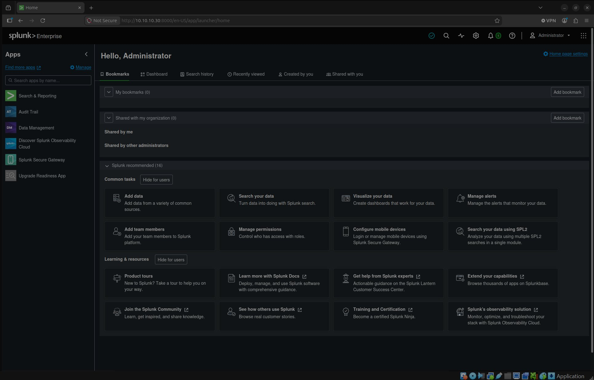
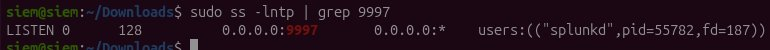

# Home Network Domain Project — Part 5: SIEM, Detection Engineering & Threat Hunting

**Part 5 of a home network lab series.** Parts 1–4 built, segmented, domained, and *instrumented* the network — `holl.domain` already produces clean Security and Sysmon telemetry on every host. This part stands up a SIEM, forwards that telemetry into it, and uses it to **detect attacks**. Deliberate misconfigurations held back from Part 4 (a Kerberoastable service account, privilege creep, and more) are planted as detection targets, attacked from a Kali box, and caught with tuned detection searches mapped to MITRE ATT&CK. The goal is hands-on detection engineering and threat-hunting practice — the blue-team half of the lab.

> **Status:** ✅ Complete — all seven phases done and verified. Each phase below documents what was done, with screenshots and verified results (same style as Parts 1–4), the status marker (⬜ pending / 🟡 in progress / ✅ complete), and per-phase troubleshooting logs.

---

## Series

- [Part 1 — OPNsense Firewall/Router Deployment](https://github.com/TannerHollaway/ReplacingHomeRouterWithOPNsense)
- [Part 2 — VLAN Segmentation and Multi-SSID Wireless Setup](https://github.com/TannerHollaway/VLAN-Segmentation-and-Multi-SSID-Wireless-Setup)
- [Part 3 — Windows Server 2022 Active Directory Domain](https://github.com/TannerHollaway/Windows-Server-2022-Active-Directory-Domain)
- [Part 4 — Domain Expansion & Security Instrumentation](https://github.com/TannerHollaway/Domain-Expansion-Security-Instrumentation)
- **Part 5 — SIEM, Detection Engineering & Threat Hunting** ← this repo

---

## Overview

Part 4 left `holl.domain` as a clean, securely-configured, and *observable* environment. Part 5 closes the loop: it centralizes that observability in a SIEM and proves the telemetry is actually **actionable** — that real attacker behavior can be seen, queried, and alerted on. Work proceeds in two halves: first the detection platform and ingestion pipeline are built and a baseline of "normal" is established; then misconfigurations are deliberately introduced as targets, attacked from Kali, and detected — each detection mapped to MITRE ATT&CK and tuned against the baseline to control false positives.

**Skills demonstrated:** SIEM deployment, log forwarding architecture (Universal Forwarder → indexer), Windows Event Log and Sysmon parsing, SPL detection authoring and tuning, MITRE ATT&CK mapping, adversary emulation (Kerberoasting, privilege escalation, lateral movement), and threat-hunting / incident-timeline reconstruction.

---

## Tooling & Design Decisions

| Decision | Choice | Notes |
| --- | --- | --- |
| SIEM | **Splunk (Developer license)** | 10 GB/day, full Enterprise features incl. scheduled alerting; ~6-month renewable, non-production. SPL is the most transferable SOC skill. |
| SIEM host | **Ubuntu VM (VirtualBox)** on the main rig | Linux host → not a domain member, so a domain compromise doesn't directly grant SIEM access. |
| SIEM placement | **VLAN 10 (Main)**, initially | Flat with monitored hosts for fast time-to-value. *Hardening step (deferred): relocate to a dedicated management VLAN so the SIEM sits off the segment it monitors.* |
| Log collection | **Splunk Universal Forwarder** on DC01 / FS01 / CLIENT01 | Forwarders → Splunk receiver on TCP 9997. |
| Parsing | Splunk Add-on for Microsoft Windows + Splunk Add-on for Sysmon | Field extraction / normalization on the indexer. |
| Attacker | **Kali Linux VM** (REMnux container available) | Impacket / Rubeus / hashcat for emulation and offline cracking. |
| Detection mapping | **MITRE ATT&CK** | Every detection tagged with its technique ID; coverage tracked in an ATT&CK Navigator layer. |

---

## Architecture

```
                         Internet
                            │
                  Existing Router (192.168.1.1)
                            │
       OPNsense — firewall / router / DNS forwarder
                            │  trunk: VLANs 10 / 20 / 30
                     TL-SG108E Switch
                            │
        VLAN 10 — Main (10.10.10.0/24)
        ┌──────────┬──────────┬───────────┬──────────────┬─────────────┐
      DC01       FS01      CLIENT01      SIEM           KALI
   DC + DNS   file server   (VM)      Splunk Free     (attacker VM)
  10.10.10.10 10.10.10.20            Ubuntu/VBox
        │          │          │       (receiver :9997)
        └──────────┴──────────┴───────────┘
          Universal Forwarders  ──►  Splunk  ◄── attacks originate from Kali
          (Security + Sysmon logs)
```

*Diagram reflects the initial VLAN 10 placement; update if the SIEM is later moved to a management VLAN.*

---

## Telemetry Already in Place (from Part 4)

Part 5 detects signal the domain is **already producing** — no new logging is required for the primary targets.

| Source | Events | Enables detection of |
| --- | --- | --- |
| Audit Baseline GPO — Logon/Logoff | 4624, 4625, 4672 | Brute force, suspicious / privileged logons |
| Audit Baseline GPO — Account Mgmt | 4720, 4722, 4724, 4726, 4738 | Account creation / manipulation |
| Audit Baseline GPO — Security Group Mgmt | 4728, 4732, 4756 | Privilege creep (adds to privileged groups) |
| Audit Baseline GPO — Detailed Tracking | 4688 (with command line) | Malicious process execution |
| Audit Baseline GPO — Account Logon (Kerberos) | 4768, 4769 | Kerberoasting (4769 RC4 ticket requests) |
| Sysmon (SwiftOnSecurity config) | 1, 3, 22, etc. | Process lineage, network connections, DNS, registry |

---


 **Phase 1 — Stand up the SIEM** (Ubuntu VM in VirtualBox, install Splunk, apply Developer license, enable receiver on 9997)
 **Phase 2 — Ingestion pipeline** (Universal Forwarder on DC01/FS01/CLIENT01 + parsing add-ons; verify parsed events)
 **Phase 3 — Baseline & detection framework** (know-normal, naming/ATT&CK-tag convention, first detection on a benign trigger)
 **Phase 4 — Kerberoasting** (plant SPN service account, attack from Kali, crack offline, detect via 4769 + Sysmon)
 **Phase 5 — Privilege creep** (add user to privileged group, detect via 4728/4732/4756; pair with deny-logon GPO)
 **Phase 6 — Attack chain & threat hunt** (multi-stage emulation, per-stage detection, hypothesis-driven hunt + timeline)
 **Phase 7 — Tuning, coverage map & writeup** (false-positive tuning, ATT&CK Navigator heatmap, dashboards, final docs)

---

## Phase 1 — Stand Up the SIEM

**Why:** A SIEM centralizes telemetry from every host into one searchable place — the foundation for detection and hunting. A standalone Linux instance keeps the SIEM outside the Windows domain it monitors.

**Plan:**
- Create an Ubuntu VM in VirtualBox (bridged onto VLAN 10), static IP on the Main subnet.
- Install Splunk; bring up Splunk Web; apply the Developer license.
- Enable receiving on TCP 9997 for forwarders.

**Verification (to confirm):** Splunk Web reachable from the rig; receiver listening on 9997; instance shows the Developer license (10 GB/day).


**Result:** Ubuntu VM `siem` at `10.10.10.30/24` (VLAN 10); Splunk Enterprise 10 with the **Developer license** (10 GB/day) active; receiver listening on TCP **9997**.



*Splunk Enterprise web UI up and running on the SIEM host.*


*Receiver confirmed: splunkd listening on TCP 9997 for forwarder traffic.*

---

## Phase 2 — Ingestion Pipeline

**Why:** Detections are only as good as the data feeding them. This phase gets Security and Sysmon logs off each host and into Splunk, correctly parsed into fields.

**Plan:**
- Install the Splunk Universal Forwarder on DC01, FS01, and CLIENT01; point each at the SIEM:9997.
- Configure inputs for `WinEventLog://Security` and `WinEventLog://Microsoft-Windows-Sysmon/Operational`.
- Install the Splunk Add-on for Microsoft Windows and the Splunk Add-on for Sysmon on the indexer for parsing.
- *(Enterprise touch / optional: deploy the forwarder via GPO, mirroring the Part 4 Sysmon deployment.)*

**Verification (to confirm):** events from all three hosts searchable; Sysmon and Security fields extracted (host, user, process, command line, event code).


**Result:** All three hosts forward Security + Sysmon Operational into `index=windows`, parsed by the add-ons. Verified six host/source combinations (DC01, FS01, CLIENT01 × `XmlWinEventLog:Security` + `XmlWinEventLog:Microsoft-Windows-Sysmon/Operational`).

**What was done:**
- Created the `windows` index on the SIEM.
- Installed parsing add-ons on the SIEM: **Splunk Add-on for Microsoft Windows** (app 742) + **Splunk Add-on for Sysmon** (app 5709).
- Installed the **Universal Forwarder** on DC01, FS01, CLIENT01 (Local System account), each pointed at the receiving indexer `10.10.10.30:9997`.
- Deployed the same `inputs.conf` to each host (`C:\Program Files\SplunkUniversalForwarder\etc\system\local\inputs.conf`):

```ini
[WinEventLog://Security]
disabled = 0
index = windows
renderXml = true

[WinEventLog://Microsoft-Windows-Sysmon/Operational]
disabled = 0
index = windows
renderXml = true
```

> **Design note — sourcetype vs source:** With `renderXml = true`, every Windows channel shares the unified sourcetype `XmlWinEventLog`; the originating channel is carried in the `source` field (`XmlWinEventLog:Security`, `XmlWinEventLog:Microsoft-Windows-Sysmon/Operational`). The add-ons parse off sourcetype **plus** source, so split channels with `source`, not `sourcetype`.

**Troubleshooting log:**

| # | Symptom | Cause | Resolution |
| --- | --- | --- | --- |
| 1 | DC01 forwarded Security but no Sysmon | Sysmon wasn't installed on the DC — the Part 4 GPO deploys it via a *startup* script that hadn't run on the rarely-rebooted DC. After installing, the forwarder still missed it because it had started before the channel existed and does not retry. | Installed Sysmon on DC01, then restarted the Universal Forwarder so it subscribed to the now-existing channel. |
| 2 | `stats count by host, sourcetype` showed only `XmlWinEventLog` — looked like Sysmon was missing | Not an error: `renderXml = true` gives all channels the unified `XmlWinEventLog` sourcetype; the channel lives in the `source` field. | Distinguished channels with `source` (`stats count by host, source`). |
| 3 | FS01 + CLIENT01 forwarded Security but never Sysmon; `splunkd.log` showed `Could not subscribe to ... Microsoft-Windows-Sysmon/Operational ... errorCode=5` (Access Denied) | The forwarder ran under the restricted virtual account `NT SERVICE\SplunkForwarder`. Sysmon's Operational channel ACL grants read only to SYSTEM/Administrators, so the virtual account was denied; the Security channel allows broader read, which is why it worked. DC01 was unaffected — it runs as Local System. | Set the SplunkForwarder service to log on as **Local System** on both hosts and restarted. *(Least-privilege alternative logged for future hardening: grant the service account read on the Sysmon channel ACL instead of using Local System.)* |

**📸 Screenshots:**
- `index=windows | stats count by host, source` — six rows (3 hosts × Security + Sysmon)
- A parsed Sysmon Event ID 1 and a parsed Security event showing extracted fields

---

## Phase 3 — Baseline & Detection Framework

**Why:** Detection without knowing "normal" produces alert fatigue. This phase builds familiarity with the data and establishes the conventions every later detection follows.

**Plan:**
- Explore baseline activity: logon patterns, process creation, group membership, Kerberos ticket requests.
- Define the detection convention: alert naming, description format, an ATT&CK technique tag, and a schedule + trigger condition per detection.
- Build one detection end to end on a **safe, self-triggered** signal — failed-logon brute force (**T1110**) — and validate it by generating the activity.

**Verification (to confirm):** the brute-force alert triggers on the test activity, documented with its ATT&CK ID and tuning notes.


**Result:** First detection live as a scheduled alert — `T1110 - Brute Force - Excessive Failed Logons` runs every 5 minutes and fired correctly on a simulated brute-force burst from CLIENT01 (8 failed logons against one account), landing in Triggered Alerts at High severity.

**Detection convention (reused by every later detection):**
- **Name:** `<ATT&CK ID> - <Technique> - <What it catches>` — greppable by technique ID, readable at a glance.
- **Description:** tactic + technique (ATT&CK ID), what it detects, the data source, and the threshold/tuning note.
- **Delivery:** a scheduled alert (cron) with an explicit trigger condition and a trigger action (Add to Triggered Alerts + severity).

**Detection #1 — T1110 Brute Force:**
```spl
index=windows EventCode=4625
| stats count AS failed_attempts, values(src) AS source BY TargetUserName
| where failed_attempts >= 5
```
- **Alert:** schedule `*/5 * * * *` (every 5 min over Last 5 minutes); trigger when results > 0; action Add to Triggered Alerts, Severity High.
- **Test:** 8 failed network logons fired from CLIENT01 — `net use \\10.10.10.10\C$ /user:holl.domain\bruteforce_test WrongPass<n>` — against a non-existent account, so no lockout risk.

> **Field note — `user` vs `TargetUserName`:** the CIM-normalized `user` field proved unreliable for 4625 (it resolved to the domain `holl` on one run, the account on another). Switched to the raw `TargetUserName`, which always holds the targeted account, so the alert unambiguously names what's under attack.

> **Tuning note (deferred to Phase 7):** add throttling so a single ongoing incident doesn't re-fire every 5-minute cycle (alert storm). The threshold of 5 suits a quiet lab baseline (~0 organic failures); raise it in noisier environments.

**📸 Screenshots:**
- The final detection SPL with results (`TargetUserName=bruteforce_test`, source CLIENT01)
- The alert definition (name, schedule, trigger condition)
- The alert under Activity → Triggered Alerts

---

## Phase 4 — Kerberoasting

**Why:** A service account with an SPN and a weak password is one of the most common real-world AD weaknesses. This phase plants that target (the deferred `ServiceAccounts` work from Part 4) and detects the attack against it.

**Plan:**
- Create a service account in the `ServiceAccounts` OU, assign an SPN, set a deliberately weak password.
- From Kali, request the service ticket (`GetUserSPNs` / Rubeus) and crack it offline with hashcat.
- Detect the ticket request in Splunk via **4769** (RC4 / encryption type `0x17`, anomalous SPN request volume) plus Sysmon context.

**ATT&CK:** T1558.003 (Kerberoasting).
**Verification (to confirm):** the 4769 request is visible; the detection search isolates it; the password is recovered offline (demonstrating the weak-credential risk). Note what is *not* visible — the offline crack happens on Kali and never touches the SIEM.


**What was done (attack chain — verified):**
- Created the `ServiceAccounts` OU and the `svc_sql` user in **ADUC** (manual/GUI), set a weak password (`Password1`), and registered the SPN `MSSQLSvc/sql01.holl.domain:1433` via the **Attribute Editor** (`servicePrincipalName`). The SPN host need not exist — the KDC issues a ticket regardless.
- From Kali (`10.10.10.117`), authenticated as a normal domain user (`ahernandez`) and requested the service ticket:
  ```bash
  impacket-GetUserSPNs holl.domain/ahernandez -dc-ip 10.10.10.10 -request -outputfile kerberoast.hash
  ```
- Cracked the RC4 TGS-REP hash offline on the RTX 4090 — recovered `Password1` instantly:
  ```bash
  hashcat -m 13100 kerberoast.hash /usr/share/wordlists/rockyou.txt
  ```
- The attack surfaces in Splunk as a 4769 request for `ServiceName=svc_sql` with `TicketEncryptionType=0x17` (RC4) from the Kali IP — a clear anomaly against the all-AES (`0x12`) baseline.

**Detection logic (alert live):**
```spl
index=windows EventCode=4769 TicketEncryptionType=0x17
| stats count AS rc4_requests, values(ServiceName) AS target_service, values(IpAddress) AS source_ip BY user
| where rc4_requests > 0
```
- **Alert:** `T1558.003 - Kerberoasting - RC4 Service Ticket Request`; schedule `*/5 * * * *` (Last 5 min); trigger results > 0; Add to Triggered Alerts, Severity High.
- **Signal rationale:** 4769 fires constantly, but RC4 (`0x17`) effectively never does in this AES-hardened domain, so any RC4 service-ticket request is suspicious.

> **Field note:** encryption type field is `TicketEncryptionType` (`0x17` = RC4, `0x12` = AES256). The requesting account is in `TargetUserName`; `ServiceName` is the targeted service account.

**Troubleshooting log:**

| # | Symptom | Cause | Resolution |
| --- | --- | --- | --- |
| 1 | `GetUserSPNs` found svc_sql but failed with `KDC_ERR_ETYPE_NOSUPP` | Part 4 hardening left the domain AES-only; Impacket requested an RC4 ticket the KDC wouldn't issue. | Enabled RC4 on svc_sql only by setting `msDS-SupportedEncryptionTypes = 4` (RC4_HMAC) via the Attribute Editor — reproducing the real-world legacy misconfiguration that makes accounts roastable. |
| 2 | Still `KDC_ERR_ETYPE_NOSUPP` right after enabling RC4 | KDC cache / replication lag — the new encryption type hadn't taken effect yet. | Waited a few minutes and re-ran; the request then succeeded (no password reset required). |

> **Security insight:** because the domain defaults to AES, an attacker must *downgrade* an account to RC4 to roast it the classic way — so the `msDS-SupportedEncryptionTypes` change is itself a detectable attack signal. This is the candidate second detection (pending decision).

- ADUC Attribute Editor showing `servicePrincipalName` on svc_sql
- Kali: `GetUserSPNs` output with the `$krb5tgs$23$*svc_sql$...` hash
- Kali: hashcat recovering `Password1`
- Splunk: the 4769 / `0x17` request for svc_sql, and the saved detection alert

---

## Phase 5 — Privilege Creep

**Why:** Quietly adding a standard user to a privileged group is a classic privilege-escalation / persistence move. The Part 4 audit baseline already logs it — this phase proves it can be caught.

**Plan:**
- Add a normal user to a privileged group (e.g., Domain Admins) and detect via **4728 / 4732 / 4756**.
- Build and enforce the deferred **deny-logon GPO** (Tier 0 admin denied interactive logon on workstations), then detect a Tier 0 account logging onto a workstation as its own signal.

**ATT&CK:** T1098 (Account Manipulation), T1078.002 (Domain Accounts).
**Verification (to confirm):** the group-modification event is alerted on; a `-adm` account logon on CLIENT01 is detected.


**Part 1 — Privilege-creep detection 
- Added a normal user (`ahernandez`, HR) to **Domain Admins** via ADUC → Member Of, firing **4728** against a zero-event baseline.
- Detection covers all three group scopes (4728 global / 4732 domain-local / 4756 universal):
```spl
index=windows (EventCode=4728 OR EventCode=4732 OR EventCode=4756)
| eval member=mvindex(split(MemberName,","),0)
| stats count, values(SubjectUserName) AS added_by, values(member) AS member_added BY TargetUserName, EventCode
| where count > 0
```
- **Alert:** `T1098 - Account Manipulation - Privileged Group Modification`; `*/5 * * * *`; results > 0; Add to Triggered Alerts, High. Confirmed firing on the cron tick.
- **Field note:** on group-add events the *group* is in `TargetUserName`, the *added member* DN in `MemberName`, the *actor* in `SubjectUserName`. (Add = 4728/4732/4756; remove = 4729/4733/4757.)

**Part 2 — Deny-logon preventive control
- Created a Tier 0 group `Tier0-Admins` (Global / Security) under `AdministrationAccounts` and added `jdoe-adm`. *We deny this purpose-built group, not Domain Admins directly — denying Domain Admins risks DC services and the built-in Administrator.*
- GPO **Deny Tier0 Logon on Workstations**, linked at `Lab → Departments`, under Computer Configuration → Policies → Windows Settings → Security Settings → Local Policies → User Rights Assignment:
  - **Deny log on locally** = `Tier0-Admins`
  - **Deny log on through Remote Desktop Services** = `Tier0-Admins`
- **Scoping rationale:** linking at `Departments` inherits to every `<Dept>/Computers` OU (where the workstations live); because these are Computer-Configuration rights they harmlessly ignore the `Users` OUs, and servers are unaffected (FS01 sits in `Lab → Servers → Tier1`, outside `Departments`).
- **Verified:** logging into CLIENT01 as `jdoe-adm` is refused — *"The sign-in method you're trying to use isn't allowed."* A Domain Admin is now barred from the workstation, so its credentials can't be harvested there.

**Part 2 detection — Tier 0 logon attempt on a workstation
- A blocked Tier 0 logon surfaces as **4625** on the workstation with **`Status = 0xC000015B`** ("logon type not granted at this machine"). *Field note: the deny code lands in `Status`, not `SubStatus` (`SubStatus` was `0x0` / empty) — confirmed by reading the raw event rather than trusting the expected field.* Detection keys on the `Status` code, not the account name, so it catches any account denied by this control:
```spl
index=windows EventCode=4625 Status=0xC000015B
| stats count, values(TargetUserName) AS denied_account, values(LogonType) AS logon_type, values(host) AS workstation, min(_time) AS first, max(_time) AS last BY TargetUserName
| where count > 0
```
- **Alert:** `T1078.002 - Valid Accounts Domain - Tier0 Logon Attempt on Workstation`; `*/5 * * * *` (Last 15 min); results > 0; Add to Triggered Alerts, High. Confirmed firing in Triggered Alerts.

**Troubleshooting log:**

| # | Symptom | Cause | Resolution |
| --- | --- | --- | --- |
| 1 | Re-added the user to Domain Admins repeatedly but no new 4728s appeared in recent searches | Two things: the ADUC change wasn't being committed (forgot **Apply**), and earlier events had aged past the "Last 15 min" window (still visible in "Last 60 min"). | Pressed Apply; recognized it was a search-window issue, not a forwarding gap. |
| 2 | Suspected clock skew was hiding recent events from the alert | Investigated with `skew_seconds = _indextime - _time` — measured **~15 s**, which is healthy, so skew was ruled out. | Confirmed the data path was fine; the issue was the search window, not timing. (Worth checking — real skew *would* silently break scheduled alerts.) |
| 3 | First saved priv-creep alert only matched `EventCode=4728` and the title truncated to "Account Manipulation" | The simple single-event-ID search was saved instead of the full 3-scope detection; the title lost its ATT&CK ID. | Edited the alert's Search to the full 4728/4732/4756 query and restored the convention-compliant title. |

**📸 Screenshots:**
- ADUC Member Of showing the user added to Domain Admins; the 4728 in Splunk
- The priv-creep detection result and the Triggered Alerts entry
- `Tier0-Admins` group with `jdoe-adm`; the GPO's two Deny rights
- The blocked-logon message on CLIENT01; the 4625 / SubStatus detection

---

## Phase 6 — Attack Chain & Threat Hunt

**Why:** Real intrusions are sequences, not single events. This phase strings techniques together and practices hunting across the full data set.

**Plan:**
- Run a small chain from Kali: recon / SPN enumeration → Kerberoast → lateral movement (Impacket PsExec or pass-the-hash).
- Detect each stage and correlate them into a single incident timeline.
- Run a hypothesis-driven hunt (start from a hunch, not an alert) and document the pivot path.
- *(Optional: validate detections with Atomic Red Team — ATT&CK-indexed test cases.)*

**ATT&CK:** T1087 / T1018 (discovery), T1558.003, T1021.002 / T1570 (lateral movement).
**Verification (to confirm):** each stage detected; a reconstructed timeline; a written hunt with findings.


**The narrative:** an attacker phishes `ahernandez` (HR user) — which, via the Phase 5 privilege creep, is now Domain Admin. The attacker uses it to recon, Kerberoast, and move laterally to FS01. Earlier-phase work becomes this attack's enabler.

**Stage 1 — Recon (T1087):** ran `impacket-GetADUsers -all` from Kali (10.10.10.117) → dumped every domain user over LDAP.
- *Visibility gap discovered:* AD object reads aren't logged by default and the Windows TA filters 4662 — the LDAP queries are invisible (logged in backlog to close via DS Access auditing + canary SACL + un-filtering 4662).
- *Detection built on the achievable signal:* the **authentication footprint**, not the queries. A domain user doing an NTLM network logon is anomalous in a Kerberos-first domain.
```spl
index=windows EventCode=4624 LogonType=3 AuthenticationPackageName=NTLM TargetUserName!="*$"
| stats count, values(IpAddress) AS source_ip, values(host) AS auth_to, min(_time) AS first, max(_time) AS last BY TargetUserName
| where count > 0
```
- **Alert:** `T1087 - Account Discovery - Anomalous NTLM Authentication`, **Severity Medium** (lower-fidelity early-stage proxy — severity tiered below confirmed-malicious stages to protect High's meaning).

**Stage 2 — Credential Access (T1558.003):** re-ran the Phase 4 Kerberoast (`impacket-GetUserSPNs ... -request`) so it lands in this intrusion's window. Caught by the existing `T1558.003` alert. No new detector — reuse.

**Stage 3 — Lateral Movement (T1021.002):** `impacket-psexec ahernandez@FS01` (DA → local admin on FS01).
- *EDR reality:* default Windows Defender on FS01 caught off-the-shelf Impacket — psexec's on-disk binary (`VirTool:Win32/Impacket.D`) **and** the fileless wmiexec/smbexec behavior (`VirTool:Win32/SuspRemoteCmdCommand.F`). So execution-stage events (`WmiPrvSE→cmd`, service→shell) never fired — only the drop + service-creation artifacts survived. (Capturing clean execution telemetry is logged as an EDR-aware follow-up.)
- *Detection iterated through two real lessons:*
  - First cut keyed on Impacket's 8-random-char binary name — **too brittle** (Metasploit uses 16, attacker can rename with one flag). Lesson: detect behavior, not a tool's cosmetic default.
  - Second cut keyed on location (`.exe` written under `C:\Windows`) — **false-positive blowup**: matched 76 events, ~75 of them benign Windows servicing (Windows Update, DISM, Defender component updates writing to `\Temp\`, `\SystemTemp\`, `\SoftwareDistribution\`). Lesson: scope precisely.
  - Final: `.exe` written to the **Windows root only**, excluding subfolders — PsExec drops to the root; servicing uses subfolders. 76 → only genuine psexec drops.
```spl
index=windows EventCode=11 TargetFilename="C:\\Windows\\*.exe" TargetFilename!="C:\\Windows\\*\\*"
| rex field=TargetFilename "C:\\\\Windows\\\\(?<filename>[^\\\\]+\.exe)$"
| stats count, values(filename) AS dropped_exe, values(Image) AS writing_process, min(_time) AS first, max(_time) AS last BY host
| where count > 0
```
- **Alert:** `T1021.002 - Lateral Movement - Executable Dropped to C:\Windows`, **Severity High**. Pairs with Defender as the preventive control (defense in depth).

**Stage 4 — Correlation:** stitched the three detections' signature events into one timeline, labelled by kill-chain stage and ordered by time — proving one actor (`ahernandez`), one source (`10.10.10.117`), recon → credential access → lateral movement in sequence. Deduped variant (`stats min(_time) … BY stage`) gives the executive-summary view.

**The Hunt (hypothesis-driven, no alert):** hypothesis — *"a compromised account may be authenticating to hosts it has no business touching."* Mapped all user→host authentication, spotted `ahernandez` (HR) on FS01 + DC01 from the Kali IP, then pivoted IP → hosts → full timeline to scope the whole intrusion. Surfaced the attack from **behavior**, not IOCs. The hunt also taught the three scoping traps first-hand:

| Scoping trap | What happened | Fix |
| --- | --- | --- |
| **Field scope** | Pivoting on `IpAddress` alone silently dropped events that don't carry it (Sysmon 11 file-write; Kerberoast names the account in `ServiceName`). Under-scoped the incident. | OR across the per-event-type fields (`IpAddress`/`ServiceName`/`TargetUserName`), or use CIM `src`. |
| **Volume scope** | `stats … BY host` over 30 days returned 17k events as undifferentiated blobs — unreadable. | Scope to the attack's fingerprints (IP + known accounts) and use `table … \| sort _time` for a sequence, not a rollup. |
| **Time/order scope** | Oldest-first over a wide window buried the attack under weeks-old account-setup events. | Match the window to the incident span and `sort -_time` so the relevant end is in front. |


- The correlated attack timeline (recon → kerberoast → lateral movement, one actor)
- The Stage 3 FP blowup (76 events) vs. the tuned result (psexec drops only)
- The hunt: the user→host auth anomaly (`ahernandez` on FS01/DC01) and the final scoped attacker timeline incl. `svc_sql`

---

## Phase 7 — Tuning, Coverage Map & Writeup

**Why:** A detection that fires on normal activity is worse than none. This phase hardens the detections and presents the coverage.

**Plan:**
- Tune each detection against the baseline to remove false positives; record before/after.
- Build an ATT&CK Navigator layer showing technique coverage.
- Finalize dashboards and the analyst-style writeup (detections, hunt, incident timeline).

**Known tuning targets (logged as they surfaced during testing):**
- **Kerberoasting (T1558.003)** and **Anomalous NTLM (T1087)** re-fire on every cron cycle during repeated testing → add **throttling** (suppress repeat firings for ~60 min, keyed on `ServiceName` / `TargetUserName` respectively) so one incident doesn't become an alert storm.
- Review each alert's **Time Range vs. cron interval** for overlap-driven duplicate firings (standardize on Last 5 min / `*/5` unless a wider window is justified).
- Document a clear baseline-vs-tuned before/after (false-positive count) for at least one alert as evidence of the tuning process.

**Verification (to confirm):** detections survive a clean baseline without firing; Navigator heatmap reflects covered techniques.


**What was done:**
- **Tuning:** added **throttling** to the two storm-prone alerts — Kerberoasting (suppress 60 min by `ServiceName`) and Anomalous NTLM (suppress 60 min by `TargetUserName`) — so repeats of the *same* signal are suppressed while a *new* victim still alerts. The Stage 6 false-positive blowup (76 events → only genuine psexec drops, after scoping to the Windows root) is the documented before/after.
- **ATT&CK coverage:** `attack-navigator-coverage.json` — a Navigator layer highlighting the six validated detections across Credential Access, Persistence, Privilege Escalation, Discovery, and Lateral Movement. Each cell's tooltip records the alert, data source, validation, and phase. (Import note: decline the version-upgrade prompt to preserve the layer's colors/annotations.)
- **SOC dashboard:** `SOC - holl.domain Detection Overview` (Classic / Simple XML) — five panels: triggered detections, failed-logon brute-force watch, RC4 Kerberoast watch, privileged-group changes, and anomalous-NTLM watch. The single operational pane.

- The ATT&CK Navigator heatmap (six techniques lit)
- The SOC dashboard (all panels populated)
- A throttle config; the Stage 6 FP before/after

---

## Detections (Built & Validated)

All six are scheduled alerts (Add to Triggered Alerts), each validated against a simulated attack from Kali. Plus one paired preventive control.

| Detection (alert name) | Primary source | ATT&CK | Severity | Phase |
| --- | --- | --- | --- | --- |
| T1110 - Brute Force - Excessive Failed Logons | Security 4625 (≥5 per account) | T1110 | High | 3 |
| T1558.003 - Kerberoasting - RC4 Service Ticket Request | Security 4769 `TicketEncryptionType=0x17` | T1558.003 | High | 4 |
| T1098 - Account Manipulation - Privileged Group Modification | Security 4728 / 4732 / 4756 | T1098 | High | 5 |
| T1078.002 - Tier0 Logon Attempt on Workstation | Security 4625 `Status=0xC000015B` | T1078.002 | High | 5 |
| T1087 - Account Discovery - Anomalous NTLM Authentication | Security 4624 Type 3, NTLM (non-machine) | T1087 | Medium | 6 |
| T1021.002 - Lateral Movement - Executable Dropped to C:\Windows | Sysmon EventID 11 (Windows root) | T1021.002 | High | 6 |

**Preventive control (paired with detection):** `Deny Tier0 Logon on Workstations` GPO — `Tier0-Admins` denied interactive/RDP logon on workstation OUs (Phase 5), paired with the T1078.002 detection above (prevent + detect on the same risk).

**Coverage map:** `attack-navigator-coverage.json` (import into the [MITRE ATT&CK Navigator](https://mitre-attack.github.io/attack-navigator/)).

---

## Splunk Licensing

This lab runs on a **Splunk Developer license** (free, applied for and granted for personal / non-production use):

- **10 GB/day ingest** — ample headroom for these hosts, with room to add sources later (PowerShell Operational, CLIENT02, etc.).
- **Full Enterprise feature set** — including the search scheduler, so detections are built as **scheduled alerts** (cron schedule + trigger condition + alert action), the same pattern used in a production SOC, rather than on-demand searches.
- **Authentication and role-based access** — available (unlike Splunk Free), so the instance keeps its admin login.
- **~6-month renewable, non-production only** — noted for honesty; renew via the Splunk developer portal before expiry.

---

## Outcome

Part 5 turned the instrumented-but-passive `holl.domain` of Part 4 into a working detection-and-response capability. Starting from the Security + Sysmon telemetry already flowing on every host, this phase:

- **Stood up a SIEM and ingestion pipeline** — Splunk (Developer license) on an isolated Linux host, with Universal Forwarders shipping Security and Sysmon logs from DC01/FS01/CLIENT01 into a parsed, searchable index.
- **Built six validated detections** across the kill chain — brute force, Kerberoasting, privileged-group modification, Tier 0 workstation-logon attempts, anomalous NTLM (recon proxy), and PsExec lateral movement — each authored as a scheduled alert, mapped to MITRE ATT&CK, and proven by carrying out the corresponding attack from Kali.
- **Paired prevention with detection** — a deny-logon GPO that blocks Tier 0 admins from workstations, alongside the alert that catches the attempt (defense in depth on one risk).
- **Ran a full intrusion and hunted it down** — a four-stage attack chain (recon → Kerberoast → lateral movement) detected per-stage, correlated into a single attacker timeline, then reconstructed from behavior alone in a hypothesis-driven hunt.
- **Tuned, mapped, and presented** — throttling to kill alert-storms, an ATT&CK Navigator coverage heatmap, and a five-panel SOC dashboard as the operational pane.

**What the build deliberately surfaced (not glossed over):** the `user`-vs-`TargetUserName` field reliability trap; a forwarder Access-Denied on the Sysmon channel (virtual-account ACL); the AD-recon visibility gap (4662 unlogged / TA-filtered); default Defender catching off-the-shelf Impacket across psexec/wmiexec/smbexec; a brittle signature-vs-behavior detection rewrite; a 76-event false-positive blowup and its scoping fix; and the three hunt scoping traps (field, volume, time/order). Each is documented with cause and resolution — the troubleshooting and tuning narrative is as much the deliverable as the detections themselves.

**Skills evidenced:** SIEM deployment and log-pipeline engineering, SPL detection authoring and tuning, MITRE ATT&CK mapping, adversary emulation (Impacket / Rubeus / hashcat), incident correlation and timeline reconstruction, hypothesis-driven threat hunting, and honest detection-engineering judgment about coverage gaps and tool limitations.

## Next Steps

Backlog / deferred items:
- **Capture clean lateral-movement execution telemetry (EDR-aware lab):** default Windows Defender on FS01 caught off-the-shelf Impacket across psexec (on-disk binary → `VirTool:Win32/Impacket.D`) *and* the fileless wmiexec/smbexec (behavioral → `VirTool:Win32/SuspRemoteCmdCommand.F`), so the execution stage never produced `WmiPrvSE→cmd` / service→shell process events — only the drop+service-creation artifacts. Stage 3 detection is built on those drop/service artifacts (works, and pairs with Defender as prevention). As a follow-up, capture the *execution-stage* signal too: add a scoped/temporary Defender exclusion (or test against a host with EDR absent/misconfigured) to observe the full `WmiPrvSE.exe → cmd.exe` and service→shell chains, then build execution-stage detections. Treat as its own endpoint/EDR-focused exercise.
- **Close the AD-recon visibility gap (discovered in Phase 6):** AD object enumeration (BloodHound/SharpHound, Impacket LDAP recon) is not logged by default — read access leaves no event, and the Windows TA filters 4662 out. To gain direct visibility: enable **Audit Directory Service Access**, place a **SACL on a canary/high-value object**, and **un-filter 4662** in `Splunk_TA_windows` (props/transforms). Current coverage is the indirect NTLM-auth-anomaly proxy (`T1087 - Account Discovery - Anomalous NTLM Authentication`); this would add direct LDAP-recon detection.
- **RC4-downgrade detection (Kerberoasting setup phase):** alert on an account being switched to RC4 (`msDS-SupportedEncryptionTypes` modified to permit RC4) in an otherwise AES-only domain — catches the attacker *preparing* a roast, earlier in the kill chain than the 4769 request. First confirm whether the data exists as 4738 (account changed) or 5136 (directory-service change with attribute-level detail; requires the Directory Service Changes audit subcategory), then build against whichever is available.
- Relocating the SIEM to a dedicated management VLAN (hardening).
- Least-privilege forwarder accounts: grant the Sysmon channel ACL to the UF service account instead of running as Local System (from the Phase 2 troubleshooting log).
- Expanding detections / adding a deliberately vulnerable host for exploitation and patching practice.
